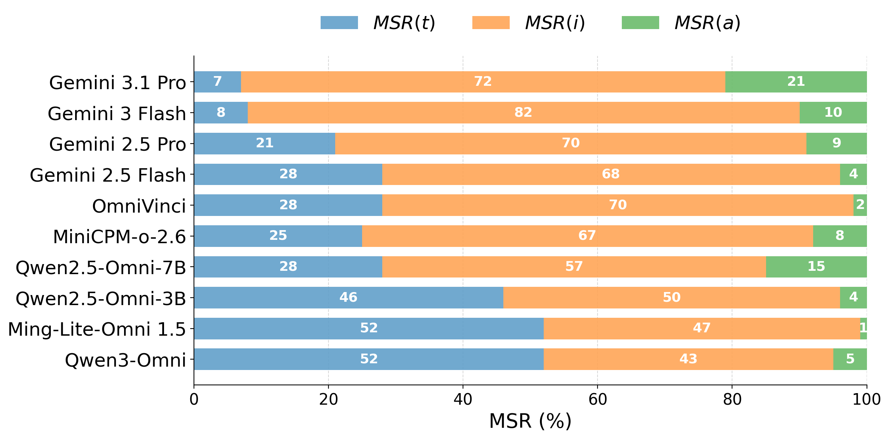
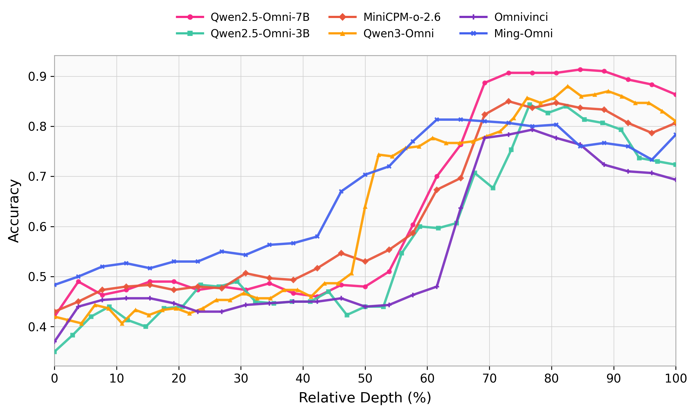
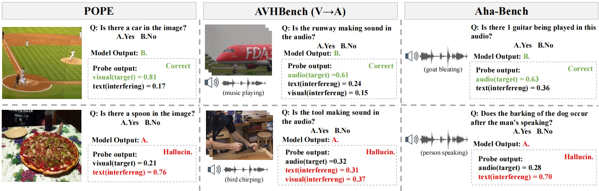

<div align="center">
<h1> Beyond Text-Dominance: Understanding Modality Preference of Omni-modal Large Language Models


[](https://opensource.org/licenses/MIT) 
</div>
 
[stars-img]: https://img.shields.io/github/stars/QingFenwy7/omni_modality_preference?color=yellow
[stars-url]: https://github.com/QingFenwy7/omni_modality_preference/stargazers
[fork-img]: https://img.shields.io/github/forks/QingFenwy7/omni_modality_preference?color=lightblue&label=fork
[fork-url]: https://github.com/QingFenwy7/omni_modality_preference/network/members


[![GitHub stars][stars-img]][stars-url]
[![GitHub forks][fork-img]][fork-url]

-------------
## 🎯 Overview

* **A modality preference evaluation framework for OLLMs:** A tri-modal semantic conflict dataset is constructed with quantitative metrics to systematically measure model modality preferences.
* **The modality preference landscape of OLLMs:** Under tri-modal conflicts, most OLLMs exhibit significant visual preference; under bi-modal conflicts, all models favor the visual modality; across all input combinations, the audio modality is systematically neglected.
* **Internal evolution of modality preference:** Layer-wise linear probing reveals that modality preference signals are absent in shallow layers and gradually emerge in mid-to-late layers.
* **Linear probes for hallucination detection:** Hallucination generation is accompanied by abnormally elevated preference probability toward the interfering modality, enabling effective hallucination detection via linear probes.


## 🔮 Usage
📍 **Data**:
```
data/conflict_triplets_processed.json
```
📍 **Data**:
<p align = "justify"> 
 MSR (%) results of all evaluated OLLMs on the tri-modal conflict dataset. 
</p>
<div  align="center">    
    
</div>


### Preference Emerges
<p align = "justify"> 
Layer-wise modality preference probe accuracy for all evaluated OLLMs.
</p>
<div  align="center">    
    
</div>


### Hallucination Detection
<p align = "justify"> 
Case study.
</p>
<div  align="center">    
    
</div>


## 📖 Citation

If you find this project helpful, please use the following to cite it:

```

```
