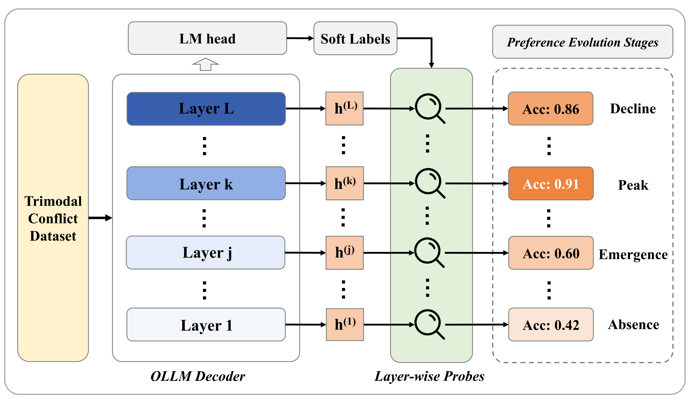
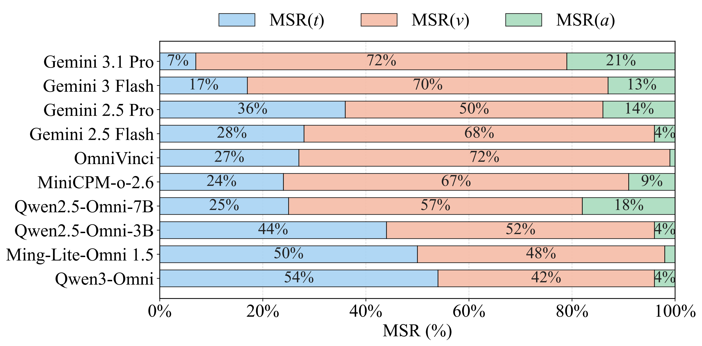
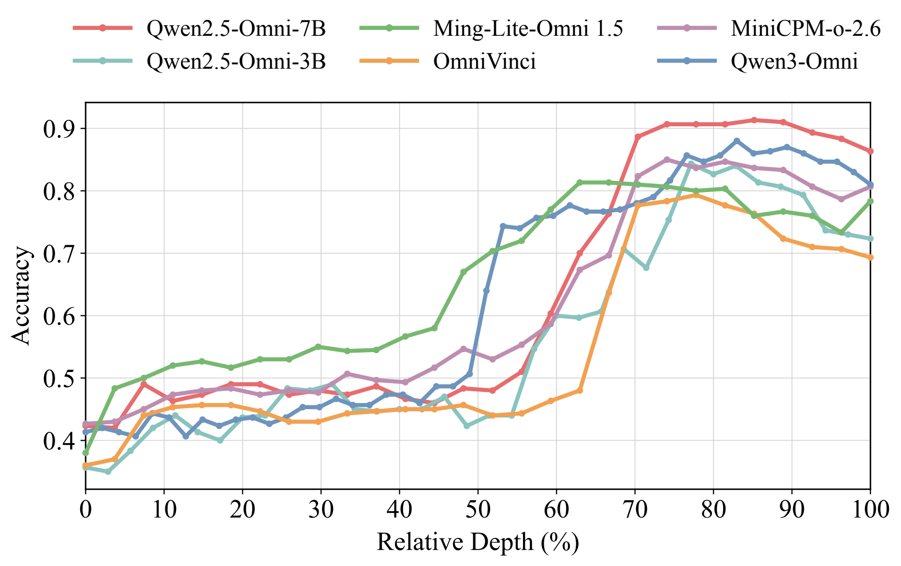
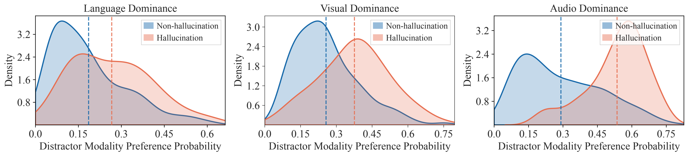
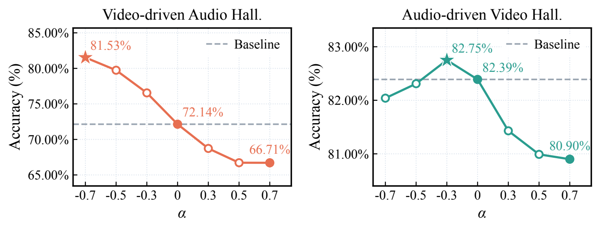

# Beyond Text-Dominance: Understanding Modality Preference of Omni-Modal Large Language Models

The paper studies **modality preference** in native omni-modal large language models (OLLMs): when text, vision, and audio provide conflicting evidence, which modality determines the model's answer? This artifact contains code for constructing a trimodal conflict benchmark, measuring modality selection rates, probing preference formation across decoder layers, analyzing its relationship with cross-modal hallucination, and causally steering modality-preference directions.

<p align="center">
  
</p>

## Table of Contents

- [Source File Structure](#source-file-structure)
- [Prerequisites](#prerequisites)
- [Study Design](#study-design)
- [Design](#design)
- [Reproduce](#reproduce)
- [Reproduction of Result Summary](#reproduction-of-result-summary)
- [Generated Analysis Results](#generated-analysis-results)
- [Notes](#notes)

## Source File Structure

```plaintext
/Omni-Preference-main
    /assets
        overview.png                              # Overall analytical framework
        tri_modal_msr.png                         # MSR results for the ten evaluated OLLMs
        probe_train_pipeline.png                  # Layer-wise probe training pipeline
        relative_depth_accuracy_curve.png         # Probe accuracy across relative depth
        qwen2.5_omni_7b_cmm_kde.png               # Distractor-preference distributions on CMM
        qwen2.5_omni_7b_steering.png              # Qwen2.5-Omni-7B steering results
    /evaluation_preference
        construct_tri_conflicrt_sample.py         # Construct balanced trimodal conflicts
        get_correct_sample.py                     # Keep unimodally correct samples
        get_common_correct_sample.py              # Intersect correct samples across models/modalities
        *_run_conflict_triplets.py                # Model-specific preference inference
        stat_modality_bias.py                     # Compute modality counts and MSR
        bootstrap.py                              # Bootstrap 95% confidence intervals
        category.txt                              # Six semantic categories used for construction
    /probe_validity
        /probe_train_<model>
            split_data.py                         # Build balanced train/validation/test splits
            conflict_three_modality_hiddenstates.py
                                                   # Extract hidden states and soft labels
            train_probe_layer.py                  # Train one linear probe per layer
            test_probe_layer_acc.py               # Evaluate and plot layer-wise accuracy
    /correlation
        *response_hiddenstates.py                 # Extract CMM/AVHBench hidden states
        layer_all_pred.py                         # Apply trained probes to every layer
        compute_p_value.py                        # Mann-Whitney U significance test
        compute_AUROC_per_layer.py                # Zero-shot hallucination AUROC
    /casual_analysis                              # Historical directory name; causal analysis code
        /qwen
            AVH_*_intervention_response.py        # AVHBench activation steering
            Omnibench_*_intervention_response.py  # OmniBench steering controls
        acc.py                                    # AVHBench result accuracy
        acc_omnibench.py                          # OmniBench result accuracy
    README.md
```

The repository contains source code and paper figures. Model checkpoints, XModBench/CMM/AVHBench/OmniBench media, generated conflict sets, hidden-state tensors, and trained probe checkpoints are not included.

## Prerequisites

- Python 3.10 or newer
- NVIDIA GPU with a CUDA-compatible PyTorch installation
- Sufficient GPU memory for the selected OLLM; the paper's evaluations used an NVIDIA A100 80GB GPU
- Local checkpoints or accessible Hugging Face model IDs for the open-source models
- Local copies of the benchmark data and media used by each experiment
- An OpenRouter API key only when reproducing the closed-source Gemini evaluations

Create an environment and install the common dependencies:

```shell
conda create -n omni-preference python=3.10 -y
conda activate omni-preference

# Install the PyTorch build matching your CUDA version first.
pip install torch torchvision torchaudio

pip install transformers accelerate safetensors qwen-omni-utils \
  numpy scipy scikit-learn matplotlib tqdm pillow \
  librosa soundfile decord moviepy av openai
```

The Qwen probe-extraction scripts request FlashAttention 2 explicitly:

```shell
pip install flash-attn --no-build-isolation
```

MiniCPM-o, OmniVinci, Ming-Lite-Omni, and Qwen3-Omni may require the package versions and remote-code dependencies specified by their official model repositories. Install those model-specific requirements in the same environment before running the corresponding adapter.

## Study Design

The artifact follows the paper's experimental pipeline.

1. Construct trimodal conflict samples from semantically aligned XModBench records. Text, image, and audio are drawn from three distinct categories among Animals, Human Activities, Music, Appliances and Machinery, Vehicles and Traffic, and Natural Sounds.
2. Balance all $\binom{6}{3}=20$ category triplets, modality-to-category assignments, and answer-option orders. Each candidate option is grounded in exactly one modality.
3. Remove samples that a model cannot answer correctly from the corresponding unimodal input. Intersect retained samples across evaluated models to obtain the shared 1,000-sample preference set.
4. Evaluate ten OLLMs and compute the **Modality Selection Rate (MSR)**. For modality $m$,

   $$
   \mathrm{MSR}(m)=\frac{1}{N}\sum_{i=1}^{N}
   \mathbf{1}\left[\hat{y}_i=\mathrm{opt}_i(m)\right].
   $$

   The uniform trimodal baseline is $1/3$.
5. For each open-source model, sample 1,000 examples per selected modality, forming a balanced 3,000-example probe dataset with an 8:1:1 train/validation/test split.
6. Extract the last prompt-token hidden state at each decoder layer, apply L2 normalization, and train a linear classifier with three outputs ordered as **text, vision, audio**. The soft target is formed from the model's probabilities for the three option tokens.
7. Apply the probes to CMM and AVHBench. Test whether hallucinated samples have higher predicted preference for the task's distractor modality, intervene along the corresponding probe-weight direction, and use the distractor probability as a zero-shot hallucination score.

The distractor modality used by each downstream task is:

| Benchmark task | Distractor modality |
| --- | --- |
| CMM Language Dominance | Text |
| CMM Visual Dominance | Vision |
| CMM Audio Dominance | Audio |
| AVHBench Video-driven Audio Hallucination | Vision |
| AVHBench Audio-driven Video Hallucination | Audio |

## Design

The complete evaluation, probing, intervention, and detection framework:


The layer-wise preference-probe training pipeline:



## Reproduce

Run commands from the repository root unless a step explicitly changes directories.

### 1. Prepare the external data

To construct conflict samples, prepare an aligned XModBench index as a JSON array. Every record must contain non-empty `id`, `text`, `image`, and `audio` fields, and the media paths must be readable in the runtime environment.

`construct_tri_conflicrt_sample.py` also expects two label files that pair each canonical XModBench label with its natural-language text form. These files are not released in this repository; provide them through `--text-labels` and `--processed-text-labels`. The included `evaluation_preference/category.txt` defines the six semantic categories.

CMM, AVHBench, and OmniBench data are likewise external. Preserve or rewrite the media paths in their JSON files so that they resolve locally.

### 2. Construct a balanced trimodal conflict pool

```shell
python evaluation_preference/construct_tri_conflicrt_sample.py \
  --input /path/to/xmodbench_modality_path.json \
  --categories evaluation_preference/category.txt \
  --text-labels /path/to/text_label.json \
  --processed-text-labels /path/to/text_label_processed.json \
  --output outputs/modality_conflict_5000.json \
  --num-samples 5000 \
  --seed 20260801 \
  --include-question
```

The constructor validates unique source triplets, category coverage, balanced category combinations, balanced modality assignments, and balanced answer-option ordering before writing the output.

### 3. Build the shared unimodally correct set

Run the matching model on the text-only, image-only, and audio-only versions of the conflict pool. Each result JSON must retain the sample `options` and add `model_raw_output`. Filter the correct samples for each modality:

```shell
python evaluation_preference/get_correct_sample.py \
  --input /path/to/text_only_results.json \
  --modality text \
  --output outputs/correct/model_text.json

python evaluation_preference/get_correct_sample.py \
  --input /path/to/image_only_results.json \
  --modality image \
  --output outputs/correct/model_image.json

python evaluation_preference/get_correct_sample.py \
  --input /path/to/audio_only_results.json \
  --modality audio \
  --output outputs/correct/model_audio.json
```

Intersect the retained files from all modalities and models:

```shell
python evaluation_preference/get_common_correct_sample.py \
  --inputs \
    outputs/correct/model1_text.json \
    outputs/correct/model1_image.json \
    outputs/correct/model1_audio.json \
    outputs/correct/model2_text.json \
    outputs/correct/model2_image.json \
    outputs/correct/model2_audio.json \
  --output outputs/conflict_sample_1000.json
```

Continue the `--inputs` list with the retained files for every evaluated model.

The paper uses the 1,000 samples shared by all ten evaluated OLLMs. A conflict pool without this filtering measures both modality preference and unimodal recognition errors, and is therefore not directly comparable to the reported MSR values.

### 4. Evaluate modality preference

The following example evaluates Qwen2.5-Omni-7B:

```shell
python evaluation_preference/qwen-2.5-omni-7B_run_conflict_triplets.py \
  --data_file outputs/conflict_sample_1000.json \
  --model_path /path/to/Qwen2.5-Omni-7B \
  --output_dir outputs/preference/qwen2.5-7b \
  --max_new_tokens 8
```

The script currently writes a historically named `Qwen2.5-Omni-7B-weak-conflict-audio-results.json` file even when a regular conflict set is supplied. Compute MSR from that output:

```shell
python evaluation_preference/stat_modality_bias.py \
  --input outputs/preference/qwen2.5-7b/Qwen2.5-Omni-7B-weak-conflict-audio-results.json
```

Equivalent adapters are provided for Qwen2.5-Omni-3B, Qwen3-Omni, MiniCPM-o-2.6, OmniVinci, Ming-Lite-Omni 1.5, and four Gemini models.

For Gemini through OpenRouter, keep the key outside source files:

```shell
# macOS/Linux
export OPENROUTER_API_KEY="your-key"

# Windows PowerShell
$env:OPENROUTER_API_KEY="your-key"

python evaluation_preference/gemini-2.5Pro_run_conflict_triplets.py \
  --data_file outputs/conflict_sample_1000.json \
  --model_name google/gemini-2.5-pro \
  --output_dir outputs/preference/gemini-2.5-pro
```

`evaluation_preference/bootstrap.py` reproduces the 10,000-resample confidence interval analysis. Set its `PATH` constant to a generated result JSON before running it.

### 5. Train and evaluate layer-wise probes

Each model directory under `probe_validity/` implements the same workflow. The Qwen2.5-Omni-7B example is shown below.

First, set `INPUT_JSON` in `probe_validity/probe_train_qwen2.5-7B/split_data.py` to a preference-result file containing at least 1,000 selected samples for each modality. Then run the splitter from that directory:

```shell
cd probe_validity/probe_train_qwen2.5-7B
python split_data.py
```

This produces 2,400 training, 300 validation, and 300 test examples. Extract hidden states separately for each split:

```shell
python conflict_three_modality_hiddenstates.py --data_file train.json --model_path /path/to/Qwen2.5-Omni-7B --output_dir hiddenstates/train
python conflict_three_modality_hiddenstates.py --data_file val.json   --model_path /path/to/Qwen2.5-Omni-7B --output_dir hiddenstates/val
python conflict_three_modality_hiddenstates.py --data_file test.json  --model_path /path/to/Qwen2.5-Omni-7B --output_dir hiddenstates/test
```

The extractor uses the fixed filename `Qwen2.5-Omni-7B-test_last_prompt_token.pt` in each output directory. Train one probe per layer and evaluate the checkpoints:

```shell
python train_probe_layer.py \
  --train_pt hiddenstates/train/Qwen2.5-Omni-7B-test_last_prompt_token.pt \
  --val_pt hiddenstates/val/Qwen2.5-Omni-7B-test_last_prompt_token.pt \
  --output_dir probe_softmax \
  --epochs 200 \
  --batch_size 256 \
  --lr 1e-3

python test_probe_layer_acc.py \
  --test_pt hiddenstates/test/Qwen2.5-Omni-7B-test_last_prompt_token.pt \
  --probe_dir probe_softmax \
  --output_png test_acc_by_layer.png
```

Repeat the corresponding directory-specific workflow for Qwen2.5-Omni-3B, Qwen3-Omni, MiniCPM-o-2.6, OmniVinci, or Ming-Lite-Omni 1.5.

### 6. Analyze hallucination correlation and detection

Extract Qwen2.5-Omni-7B hidden states on a CMM task:

```shell
cd ../../

python correlation/qwen2.5-omni-cmm-text-driven_response_hiddenstates.py \
  --data_file /path/to/cmm-language-driven.json \
  --model_path /path/to/Qwen2.5-Omni-7B \
  --output_dir outputs/correlation/cmm-language
```

Apply the trained probes to every extracted layer:

```shell
python correlation/layer_all_pred.py \
  --input_pt outputs/correlation/cmm-language/Qwen2.5-Omni-7B-CMM-language-driven-hidden-states.pt \
  --results_json outputs/correlation/cmm-language/Qwen2.5-Omni-7B-CMM-language-driven-results.json \
  --probe_dir probe_validity/probe_train_qwen2.5-7B/probe_softmax \
  --output_json outputs/correlation/cmm-language/all_layers.json \
  --start_layer 1 \
  --end_layer 28
```

Use the peak layer identified by the matching probe-accuracy curve for the Mann-Whitney U test:

```shell
python correlation/compute_p_value.py \
  --input_json outputs/correlation/cmm-language/all_layers.json \
  --distractor_modality text \
  --layer PEAK_LAYER \
  --output_txt outputs/correlation/cmm-language/p_value.txt
```

Compute zero-shot hallucination AUROC at every available layer:

```shell
python correlation/compute_AUROC_per_layer.py \
  --input_json outputs/correlation/cmm-language/all_layers.json \
  --probe_dir probe_validity/probe_train_qwen2.5-7B/probe_softmax \
  --distractor_modality text \
  --output_txt outputs/correlation/cmm-language/auroc_by_layer.txt
```

The AUROC script uses `visual` for the vision class, whereas the p-value and intervention scripts use `vision`. Preserve this historical command-line spelling difference.

### 7. Perform causal steering

The intervention code is under `casual_analysis/`; the misspelling is retained for compatibility. To sweep the visual distractor direction on AVHBench Video-driven Audio Hallucination:

```shell
for alpha in -0.7 -0.5 -0.3 0 0.3 0.5 0.7; do
  python casual_analysis/qwen/AVH_Video_driven_intervention_response.py \
    --data_file /path/to/avh-video-driven-audio-hallucination.json \
    --video_dir /path/to/avhbench/videos \
    --model_path /path/to/Qwen2.5-Omni-7B \
    --probe_dir probe_validity/probe_train_qwen2.5-7B/probe_softmax \
    --peak_layer PEAK_LAYER \
    --distractor vision \
    --coeff "$alpha" \
    --output_dir outputs/steering/qwen2.5-7b/video-driven
done
```

The intervention is $h'=h+\alpha d$, where $d$ is the normalized probe-weight column for the distractor modality. Negative coefficients suppress the direction, zero is the unmodified baseline, and positive coefficients amplify it. To aggregate results, set the input path inside `casual_analysis/acc.py` for AVHBench or `casual_analysis/acc_omnibench.py` for OmniBench, then run the selected script.

## Reproduction of Result Summary

The paper reports the following main results.

- **OLLMs are predominantly vision-preferring.** Eight of the ten evaluated models select visual evidence in more than half of the shared trimodal conflict samples. Audio is underused: audio MSR is at most 21% and is below 15% for most models.
- **Preference emerges inside the decoder.** Layer-wise probe behavior follows four stages: Absence in roughly the first 40% of layers, Emergence around 40%-70%, Peak around 70%-90%, and Decline in the final layers. Qwen2.5-Omni-7B reaches a peak probe accuracy of 0.91.
- **Preference correlates with hallucination.** On Qwen2.5-Omni-7B, hallucinated CMM samples have systematically higher probe-estimated preference for the distractor modality. Mann-Whitney U p-values are $1.82\times10^{-6}$ for Language Dominance, $3.99\times10^{-12}$ for Visual Dominance, and $1.05\times10^{-30}$ for Audio Dominance.
- **The effect is causal.** On AVHBench Video-driven Audio Hallucination, suppressing Qwen2.5-Omni-7B's visual distractor direction with $\alpha=-0.7$ raises accuracy from 72.14% to 81.53%. Applying the same visual suppression to OmniBench raises accuracy from 49.47% to 56.14%.
- **The probes support zero-shot hallucination detection.** Across Qwen2.5-Omni-7B, MiniCPM-o-2.6, and Qwen3-Omni, the mean AUROC on CMM Audio Dominance is 0.83, without downstream task-specific training.

Rounded MSR values from the paper are:

| Model | Text | Vision | Audio |
| --- | ---: | ---: | ---: |
| Gemini 3.1 Pro | 7% | **72%** | 21% |
| Gemini 3 Flash | 17% | **70%** | 13% |
| Gemini 2.5 Pro | 36% | **50%** | 14% |
| Gemini 2.5 Flash | 28% | **68%** | 4% |
| OmniVinci | 27% | **72%** | 1% |
| MiniCPM-o-2.6 | 24% | **67%** | 9% |
| Qwen2.5-Omni-7B | 25% | **57%** | 18% |
| Qwen2.5-Omni-3B | 44% | **52%** | 4% |
| Ming-Lite-Omni 1.5 | **50%** | 48% | 2% |
| Qwen3-Omni-30B-A3B-Instruct | **54%** | 42% | 4% |

## Generated Analysis Results

**RQ1: How can modality preference be quantified, and what patterns emerge?**

Modality Selection Rate across ten OLLMs:



**RQ2: How does modality preference form inside OLLMs?**

Layer-wise probe accuracy across relative model depth:



**RQ3: How can preference mechanisms improve downstream reliability?**

Distractor-modality preference distributions for hallucination and non-hallucination samples:



Accuracy under Qwen2.5-Omni-7B steering coefficients:



## Notes

- Run model-specific scripts with the checkpoint versions and processor code expected by that model. Architectures expose hidden states differently, which is why separate adapters are included.
- Open-source preference evaluation uses deterministic decoding. Preserve `do_sample=False`, temperature zero, or the model-specific equivalent when comparing MSR values.
- The 1,000-example shared evaluation set is produced only after unimodal-correctness filtering and intersection across all evaluated models; it is not included in this repository.
- `split_data.py` files use editable constants rather than command-line arguments and require at least 1,000 examples assigned to each of text, image, and audio.
- Hidden-state `.pt` files and layer-wise probe checkpoints can be large and are not released. Regenerate them with the model-specific extraction scripts.
- Probe class order is always text, vision/image, audio. Do not change this order when interpreting probabilities or selecting probe-weight columns.
- Layer indices are architecture-specific. Determine `PEAK_LAYER` from the corresponding model's probe curve rather than copying an index from another model.
- Several output names and the `casual_analysis/` directory preserve historical spelling. The commands above use the names currently implemented by the code.
- Live APIs, model revisions, attention implementations, hardware, and decoding-library versions can affect regenerated outputs. Use the paper's deterministic settings and the same filtered sample IDs for direct comparison.
