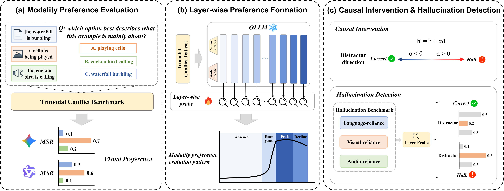

<div align="center">

# Beyond Text-Dominance: Understanding Modality Preference of Omni-Modal Large Language Models
</div>

When text, vision, and audio conflict, most native omni-modal large language models prefer visual evidence. This preference emerges in the middle-to-late decoder layers, causally contributes to cross-modal hallucination, and can be reused as a zero-shot hallucination signal.

<p align="center">
  
</p>

## Overview

Native omni-modal large language models (OLLMs) map text, vision, and audio into a unified representation space, but they do not necessarily use these modalities equally. **Omni-Preference** studies what happens when the three modalities provide mutually conflicting semantic evidence.

This repository supports four connected experiments:

- **Preference evaluation:** construct a controlled trimodal conflict benchmark and quantify each model's modality preference with Modality Selection Rate (MSR).
- **Mechanistic probing:** train a linear probe at every decoder layer to locate when modality preference forms.
- **Hallucination analysis:** measure how abnormal preference for a distractor modality relates to cross-modal hallucination.
- **Causal intervention and detection:** steer probe-derived modality directions and reuse probe scores for zero-shot hallucination detection.

## Contents
- [Repository Structure](#repository-structure)
- [Installation](#installation)
- [Quick Start](#quick-start)
- [Layer-wise Preference Probing](#layer-wise-preference-probing)
- [Hallucination Correlation and Detection](#hallucination-correlation-and-detection)
- [Causal Steering](#causal-steering)
- [Reproducibility Notes](#reproducibility-notes)
- [Citation](#citation)
- [Acknowledgements](#acknowledgements)

## Repository Structure

```text
|-- assets/                  # Paper figures used in this README
|-- evaluation_preference/  # Conflict construction, model inference, MSR statistics
|-- probe_validity/         # Model-specific hidden-state extraction and layer probes
|-- correlation/            # CMM/AVHBench extraction, significance tests, AUROC
|-- casual_analysis/        # Probe-derived activation steering
-- README.md
```

## Installation

```bash
conda create -n omni-preference python=3.10 -y
conda activate omni-preference

# Install the PyTorch build matching your CUDA environment first.
pip install torch torchvision torchaudio

pip install transformers accelerate safetensors \
  qwen-omni-utils numpy scipy scikit-learn matplotlib tqdm \
  pillow librosa soundfile decord moviepy av openai
```

```bash
pip install flash-attn --no-build-isolation
```

MiniCPM-o, OmniVinci, Ming-Lite-Omni, and Qwen3-Omni may require additional dependencies or specific `transformers` revisions from their official repositories. Install the requirements of the model adapter you plan to run.

## Quick Start

### 1. Construct the Conflict Pool

```bash
python evaluation_preference/construct_tri_conflicrt_sample.py \
  --input /path/to/xmodbench_modality_path.json \
  --categories evaluation_preference/category.txt \
  --text-labels /path/to/text_label.json \
  --processed-text-labels /path/to/text_label_processed.json \
  --output outputs/modality_conflict_5000.json \
```

### 2. Build the Shared Unimodally Correct Set

Run each model on text-only, image-only, and audio-only versions of the conflict pool. Each result must retain `options` and add `model_raw_output`. Filter correct samples with:

```bash
python evaluation_preference/get_correct_sample.py \
  --input /path/to/text_only_results.json \
  --modality text \
  --output outputs/correct/model_text.json
```

Use `--modality image` and `--modality audio` for the other inputs, then intersect all retained files:

```bash
python evaluation_preference/get_common_correct_sample.py \
  --inputs \
    outputs/correct/model1_text.json \
    outputs/correct/model1_image.json \
    outputs/correct/model1_audio.json \
    outputs/correct/model2_text.json \
    outputs/correct/model2_image.json \
    outputs/correct/model2_audio.json \
  --output outputs/conflict_sample_1000.json
```

### 3. Evaluate Modality Preference

Example for Qwen2.5-Omni-7B:

```bash
python evaluation_preference/qwen-2.5-omni-7B_run_conflict_triplets.py \
  --data_file outputs/conflict_sample_1000.json \
  --model_path /path/to/Qwen2.5-Omni-7B \
  --output_dir outputs/preference/qwen2.5-7b \
  --max_new_tokens 8
```

Compute MSR:

```bash
python evaluation_preference/stat_modality_bias.py \
  --input outputs/preference/qwen2.5-7b/Qwen2.5-Omni-7B-weak-conflict-audio-results.json
```

For closed-source Gemini models, set an OpenRouter key without placing it in source files:

```bash
export OPENROUTER_API_KEY="your-key"

python evaluation_preference/gemini-2.5Pro_run_conflict_triplets.py \
  --data_file outputs/conflict_sample_1000.json \
  --model_name google/gemini-2.5-pro \
  --output_dir outputs/preference/gemini-2.5-pro
```

## Layer-wise Preference Probing

Each directory under `probe_validity/` implements the same pipeline for a different model architecture:

1. Create a balanced 8:1:1 split.
2. Extract last prompt-token hidden states and option-token soft labels.
3. Train one three-way linear probe per decoder layer.
4. Evaluate layer-wise probe accuracy.

Example for Qwen2.5-Omni-7B:

```bash
cd probe_validity/probe_train_qwen2.5-7B
```

Set `INPUT_JSON` in `split_data.py` to a sufficiently large preference-result file, then run:

```bash
python split_data.py

python conflict_three_modality_hiddenstates.py \
  --data_file train.json \
  --model_path /path/to/Qwen2.5-Omni-7B \
  --output_dir hiddenstates/train

python conflict_three_modality_hiddenstates.py \
  --data_file val.json \
  --model_path /path/to/Qwen2.5-Omni-7B \
  --output_dir hiddenstates/val

python conflict_three_modality_hiddenstates.py \
  --data_file test.json \
  --model_path /path/to/Qwen2.5-Omni-7B \
  --output_dir hiddenstates/test
```

Train and evaluate all layer-wise probes:

```bash
python train_probe_layer.py \
  --train_pt hiddenstates/train/Qwen2.5-Omni-7B-test_last_prompt_token.pt \
  --val_pt hiddenstates/val/Qwen2.5-Omni-7B-test_last_prompt_token.pt \
  --output_dir probe_softmax \
  --epochs 200 \
  --batch_size 256 \
  --lr 1e-3

python test_probe_layer_acc.py \
  --test_pt hiddenstates/test/Qwen2.5-Omni-7B-test_last_prompt_token.pt \
  --probe_dir probe_softmax \
  --output_png test_acc_by_layer.png
```

## Hallucination Correlation and Detection

python correlation/qwen2.5-omni-cmm-text-driven_response_hiddenstates.py \
  --data_file /path/to/cmm-language-driven.json \
  --model_path /path/to/Qwen2.5-Omni-7B \
  --output_dir outputs/correlation/cmm-language
```

Apply every available layer-wise probe:

```bash
python correlation/layer_all_pred.py \
  --input_pt outputs/correlation/cmm-language/Qwen2.5-Omni-7B-CMM-language-driven-hidden-states.pt \
  --results_json outputs/correlation/cmm-language/Qwen2.5-Omni-7B-CMM-language-driven-results.json \
  --probe_dir probe_validity/probe_train_qwen2.5-7B/probe_softmax \
  --output_json outputs/correlation/cmm-language/all_layers.json \
  --start_layer 1 \
  --end_layer 28
```

Test the distractor-preference distribution at the peak layer:

```bash
python correlation/compute_p_value.py \
  --input_json outputs/correlation/cmm-language/all_layers.json \
  --distractor_modality text \
  --layer PEAK_LAYER \
  --output_txt outputs/correlation/cmm-language/p_value.txt
```

Compute per-layer zero-shot hallucination AUROC:

```bash
python correlation/compute_AUROC_per_layer.py \
  --input_json outputs/correlation/cmm-language/all_layers.json \
  --probe_dir probe_validity/probe_train_qwen2.5-7B/probe_softmax \
  --distractor_modality text \
  --output_txt outputs/correlation/cmm-language/auroc_by_layer.txt
```

## Causal Steering

```bash
python casual_analysis/qwen/AVH_Video_driven_intervention_response.py \
  --data_file /path/to/avh-video-driven-audio-hallucination.json \
  --video_dir /path/to/avhbench/videos \
  --model_path /path/to/Qwen2.5-Omni-7B \
  --probe_dir probe_validity/probe_train_qwen2.5-7B/probe_softmax \
  --peak_layer PEAK_LAYER \
  --distractor vision \
  --coeff -0.7 \
  --output_dir outputs/steering/qwen2.5-7b/video-driven
```

## Citation

If you find this work useful, please consider citing:

```bibtex
@article{yan2026beyond,
  title={Beyond Text-Dominance: Understanding Modality Preference of Omni-modal Large Language Models},
  author={Yan, Xinru and Cao, Boxi and Lu, Yaojie and Lin, Hongyu and Zhou, Weixiang and Sun, Le and Han, Xianpei},
  journal={arXiv preprint arXiv:2604.16902},
  year={2026}
}
```
